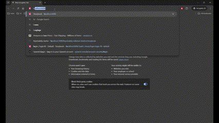
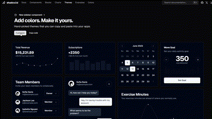
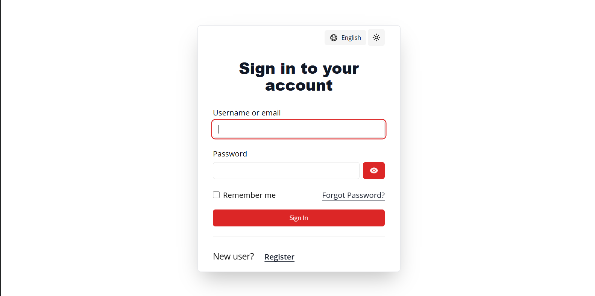
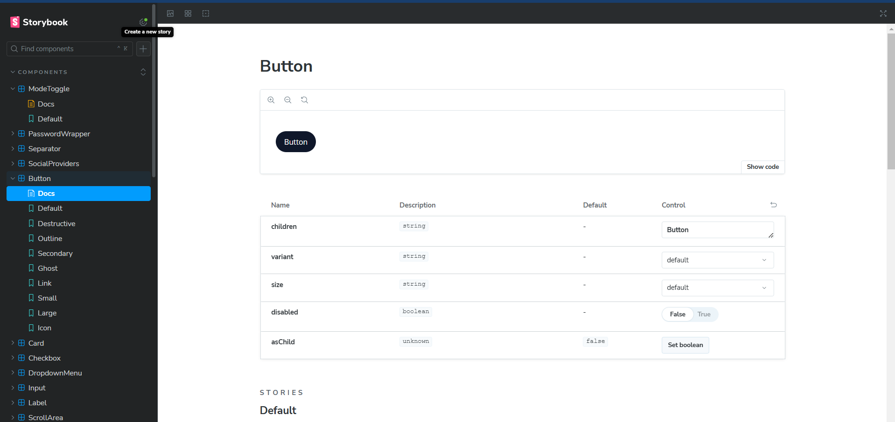
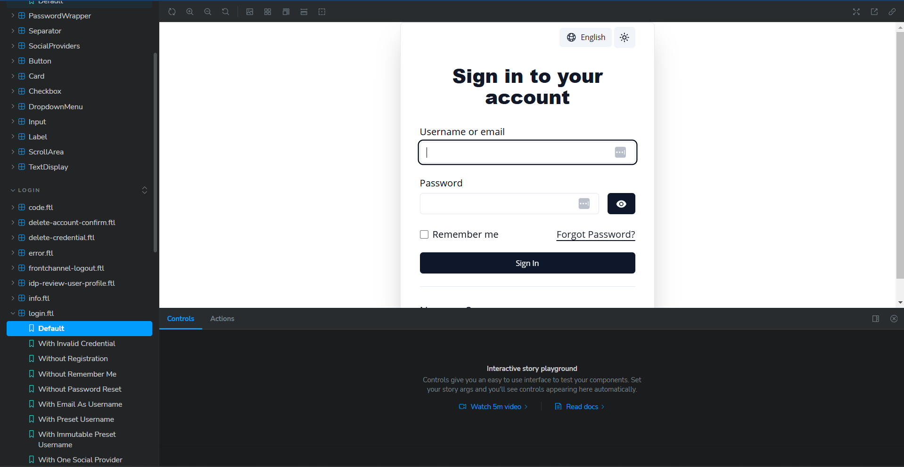
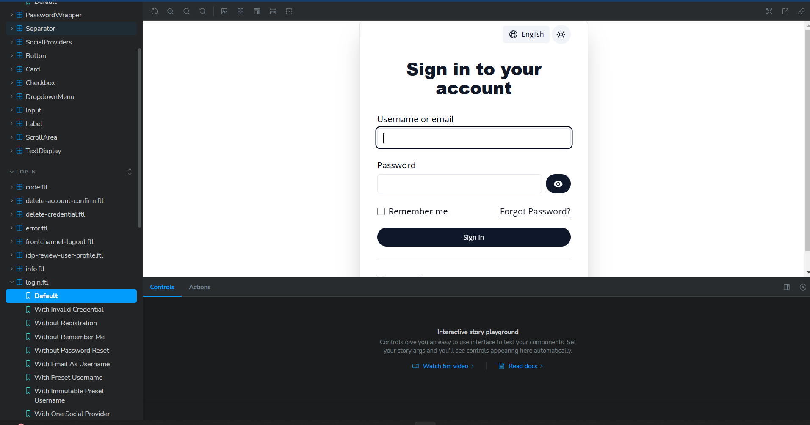

# 🚀 Keycloakify + Tailwind CSS & ShadCN UI: Enhancing Keycloak Themes 🚀

Welcome to the Keycloakify + Tailwind CSS & ShadCN UI repository! This project is a community-driven effort aimed at making Keycloak theming more accessible, modern, and easy to customize. By integrating Tailwind CSS and ShadCN UI, I am upgrading the Keycloakify ecosystem, one page at a time, to meet the needs of modern front-end development.

This project is designed to be developer-friendly, making it easy to customize themes or individual components to suit your specific needs. With the help of Storybook, developers can modify components in isolation, streamlining the customization process.

I strongly believe in the Keycloak ecosystem and found Keycloakify to be an extremely stable and reliable tool for creating custom Keycloak themes. My goal is to further enhance Keycloakify for this specific front-end use case and to make it easier for others to build on top of my work.

[](https://youtu.be/xmQ5ULhF1Dk)

### [Watch this video on YouTube](https://youtu.be/xmQ5ULhF1Dk)

## 📢 Spoiler Alert

🚨 **Spoiler Alert:** We’ve just initiated support for **multiple screen sizes** as of **16/9/2024**! 🚨
If things look a bit off on mobile phones or smaller screens, no worries—we're actively working on making this project fully responsive.
Stay tuned for exciting updates and improvements coming soon!

## 🌟 Live Demo

You can explore and test the components used in this project through the live Storybook:

[View Storybook](https://nima70.github.io/keycloakify-tailwind-shadcn/storybook/)

## 💡 Why This Project?

This project is designed to help the Keycloak developer community by providing a ready-to-use template that integrates Tailwind CSS and ShadCN UI components. Developers can now easily build on this foundation, customizing either the entire theme or individual components in isolation using Storybook. With these tools, creating modern, responsive Keycloak UIs is easier than ever.

Contributions are highly encouraged! Whether you're passionate about Keycloak, Tailwind CSS, or ShadCN, let's collaborate to make Keycloak theming easier and more powerful for everyone.

[](https://youtu.be/LG5Wv7dsh4I)

### [Watch this video on YouTube](https://youtu.be/LG5Wv7dsh4I)

## 🚀 Quick Start

[](https://youtu.be/5pBc1C1wgiQ)

### [Watch this video on YouTube](https://youtu.be/5pBc1C1wgiQ)

Clone this repository:

```bash
git clone https://github.com/nima70/keycloakify-tailwind-shadcn.git
```

Install dependencies:

```bash
npm install --legacy-peer-deps
```

Run the project locally:

```bash

npm run prestart
npm run storybook
```



## Changing the Default Theme

Visit the ShadCN themes website:
https://ui.shadcn.com/themes

1. Select Customize.
2. Choose your theme.
3. Click Copy Code to copy the base layer to your clipboard.



4. Update the base layer by pasting the copied code into src/styles/global.css.
5. Check the result.



## Changing a Component

To modify a component, for example, you can change rounded-md to rounded-full in src/components/button.tsx. Here’s the updated code:

```typescript
const buttonVariants = cva(
    "inline-flex items-center justify-center whitespace-nowrap rounded-full text-sm font-medium ring-offset-background transition-all focus-visible:outline-none focus-visible:ring-2 focus-visible:ring-ring focus-visible:ring-offset-2 disabled:pointer-events-none disabled:opacity-50 hover:scale-105",
    {
        variants: {
            variant: {
                default:
                    "bg-primary text-primary-foreground hover:bg-primary/50 hover:dark:bg-primary/30 hover:dark:text-secondary-foreground ",
                destructive:
                    "bg-destructive text-destructive-foreground hover:bg-destructive/90",
                outline:
                    "border border-input border-foreground bg-background text-foreground hover:bg-accent hover:text-accent-foreground",
                secondary: "bg-secondary text-secondary-foreground hover:bg-secondary/80",
                ghost: "hover:bg-accent hover:text-accent-foreground",
                link: "text-primary bg-background underline-offset-4 hover:underline"
            },
            size: {
                default: "h-10 px-4 py-2",
                sm: "h-9 rounded-md px-3",
                lg: "h-11 rounded-md px-8",
                icon: "h-10 w-10"
            }
        },
        defaultVariants: {
            variant: "default",
            size: "default"
        }
    }
);
```

You can verify the changes below:



### Login Page Changes

Below are images of the login page before and after updating the button component.

Before:



After:



## Install Maven:

You need Maven installed to build and test the Keycloak theme.

macOS:

```bash
brew install maven
```

Debian/Ubuntu:

```bash
sudo apt-get install maven
```

Windows:

```bash
choco install openjdk && choco install maven
```

## Testing the Component with Docker

Run this command:

```bash
npx keycloakify start-keycloak
```

> ** Note: Keycloak version 26 is not supported yet. **

```bash
npx keycloakify start-keycloak --keycloak-version 25.0.2
```

## 📦 Building the Keycloak Theme

```bash
npm run build-keycloak-theme
```

Keycloakify generates .jar files for different Keycloak versions by default. You can customize this to suit your deployment needs. Learn more in the Keycloakify documentation.

## 🛠 Tailwind CSS & ShadCN UI Integration

This project integrates Tailwind CSS and ShadCN UI components with Keycloakify, making it easier to create custom Keycloak themes. You can easily customize individual components or the entire theme by leveraging Storybook.

Isolated Component Customization with Storybook: Every component in this project is storybook-ready, allowing you to develop and customize components in isolation. This means you can focus on fine-tuning each UI element without worrying about the rest of the application. Storybook helps in visually testing and experimenting with different styles and themes.
With the integration of Tailwind CSS, you get access to utility-first CSS for rapid styling, while ShadCN UI components provide a robust design system for professional UIs.

#### Pages Currently Enhanced:

-   Login Page
-   Terms Page
-   Register Page (in progress)
-   Error
-   Code
-   Delete Account Confirm
-   Delete Credential
-   Frontchannel Logout
-   Idp Review UserProfile
-   info
-   Login Config Totp
-   Login Idp Link Confirm
-   Login Idp Link Email
-   Login Oauth Grant
-   Login Otp
-   Login Page Expired
-   Login Password
-   Login Reset Otp
-   Login Updatte Password
-   Login Update Profile
-   Login Username
-   Login Verify Email
-   Login x509 Info
-   Logout Confirm
-   Saml Post Form
-   Select Authenticator
-   Update Email
-   Web Authn Authenticate
-   Web Authn Error
-   Web Authn Register
-   Web Authn Error
-   Login Oauth2 Device Verify User Code
-   Login Recovery Authn Code Config
-   Login Recovery Authn Code input

Stay tuned as more pages are upgraded with Tailwind CSS and ShadCN UI components!

## 🤝 How You Can Contribute

I am eager to collaborate with others who are passionate about Keycloak, Tailwind CSS, or ShadCN UI. Here’s how you can get involved:

-   Fork this repository, and submit pull requests to contribute new features or improvements.
-   Test and customize individual components using Storybook and contribute improvements to them.
-   Open issues to discuss ideas for future enhancements or provide feedback.
    Spread the word by starring this repository and sharing it with the community.
    Together, we can create a modern, highly customizable Keycloak UI for everyone!

## 🎯 Keywords & Tags

-   Keycloak custom themes
-   Tailwind CSS for Keycloak
-   ShadCN UI integration
-   Keycloakify customization
-   Modern Keycloak theming
-   Storybook for Keycloak components
-   Open-source Keycloak themes
-   Responsive Keycloak themes

## 📄 License

This project is licensed under the MIT License.

## Contact

Have questions or want to collaborate? Feel free to open an issue or reach out via email.
